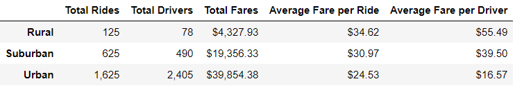
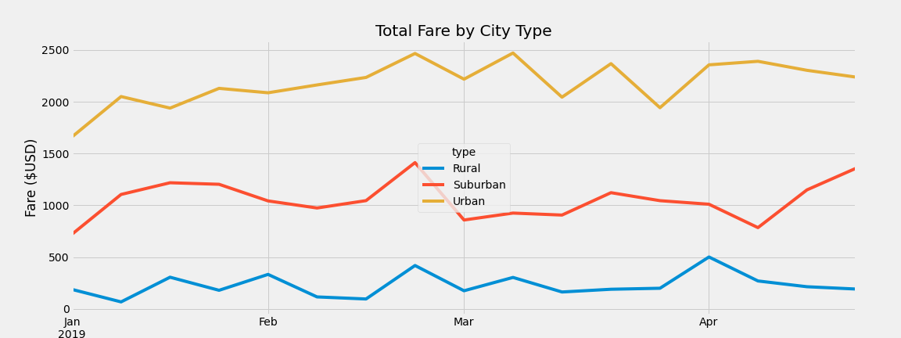
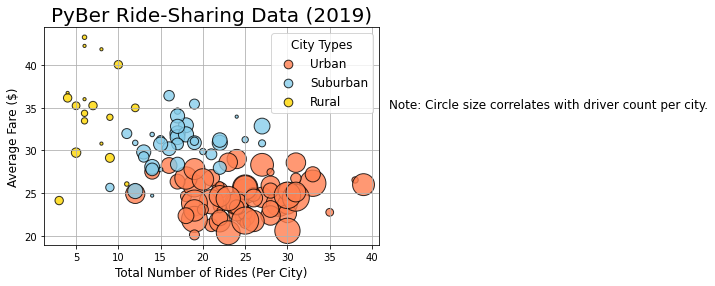

# PyBer Analysis
## Overview
### Original Project Overview
This project investigated the rideshare data from January to early May of 2019 and created the visualizations to help PyBer improve access to ride-sharing services and determine the affordability for underserved neighborhoods.  The following tasks were completed in the original project.
1.	Create a bubble chart for the ride-sharing data.
2.	Calculate summary statistics.
3.	Create a pie chart for the percentage of fares by city type.
4.	Create a pie chart for the percentage of rides by city type.
5.	Create a pie chart for the percentage of drivers by city type.
### Challenge Overview
This challenge aimed at adding the following tasks to complete the visualization.
1.	Create a ride-sharing summary DataFrame by city type.
2.	Create a multiple-line chart of the total weekly fares for each city type.

## Resources
- Data Source: city_data.csv, ride_data.csv (in the Resources folder)
- Software: Python 3.7.6

## Results
### The ride-sharing summary DataFrame by city type
Table 1 presented the ride-sharing summary DataFrame by city type.
-	There were 125 rides in the Rural, 625 rides in the Suburban, and 1,625 total rides in the Urban.
-	There were 78 drivers in the Rural, 490 drivers in the Suburban, and 2,405 total drivers in the Urban.
-	The total fares for the Rural, Suburban, and Urban were $4,327.93, $19,356.33, and $39,854.38, respectively. 
-	The average fare per ride for the Rural was $34.62; the average fare per ride for the Suburban was $30.97; the average fare per ride for the Urban was $24.53.
-	Average fares per driver for the Rural, Suburban, and Urban were $55.49, $39.50, and $16.57, respectively.

Table 1 The ride-sharing summary DataFrame by city type

### The total fares for each week by city type
Chart 1 was a multiple-line chart of total fares for each city type. 
-	Urban cities had the highest total fare, and the fare for the Rural was the lowest.
-	There was a same trend fluctuation at the end of February for 3 city types.
-	The total fare for Urban cities fluctuated in March.

Chart 1 The total fares for each week by city type

### Visualizations
Figure 1 to 4 were figures we created based on the rideshare data. They all conveyed our summary in Table 1.
-	Total fares: Rural < Suburban < Urban
-	Total rides: Rural < Suburban < Urban
-	Total drivers: Rural < Suburban < Urban
Figure 1 The bubble chart for the ride-sharing data

Figure 2 The pie chart for the percentage of fares by city type

Figure 3 The pie chart for the percentage of rides by city type

Figure 4 The pie chart for the percentage of drivers by city type

## Summary
In this project, we created visualizations to help PyBer improve access to ride-sharing services. There were three recommendations to address the disparity among the city types.

Firstly, decreasing the urban driver number. Our results indicated that there was a negative relationship between the driver number and the average fare per driver. It was reasonable because that clients had more choice if there were multiple drivers at the same time so it could lead to the fare decrease due to the fierce competition. In this case, we suggested that decreasing the driver number in urban area could reduce the competition and improve the average fare.

Secondly, increasing the rural driver number. Our ride-sharing summary showed that the rural drivers had the highest average fare among city types. It indicated high profitability for rural drivers. In this case, increasing the rural driver numbers could help expand the rural market and make more profit.

Lastly, increasing the average fare in the urban area. Our results showed that urban area had the highest ride demand and the average fare per driver was the lowest. Since the demand was strong and rigid, we assumed that a small increase in price would not have a huge impact on the market and it could increase the drivers’ profitability at the same time.
